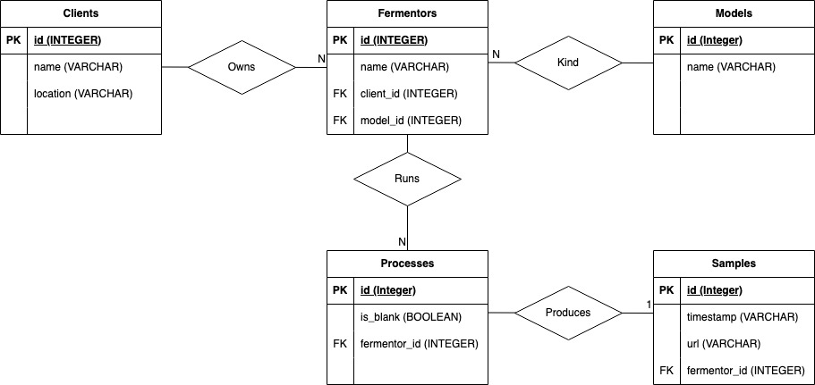

To install, run the following command -

```source install.sh```

This performs the following steps - 

1. Creates a conda environment ('ferment')
2. Installs dependencies to the created environment 
3. Creates and populates a database ('ferment.db')

To activate the new environment, run the following command -

```conda activate ferment```

The created database represents spectrum data for the production of pigments by growing microorganisms in fermentors.

To understand the database better, see the below diagram representing the relationships between each table. 


